# Enrique ESP32-S3 — mini camera project

A quick experiment that asks: **what can you actually do with a tiny ESP32 that already has a camera, a touchscreen, and a home button?**

This firmware turns a [Waveshare ESP32-S3-Touch-LCD-2](https://www.waveshare.com/wiki/ESP32-S3-Touch-LCD-2) into a pocket **mini iPhone-style device**. It boots into a launcher, not a single sketch. From there you open apps, change settings, take pictures, record video, run a wireless webcam, try on-device object labels, and watch live air traffic over your house.

One firmware. One home button. Several apps.

<table align="center">
  <tr>
    <td>
      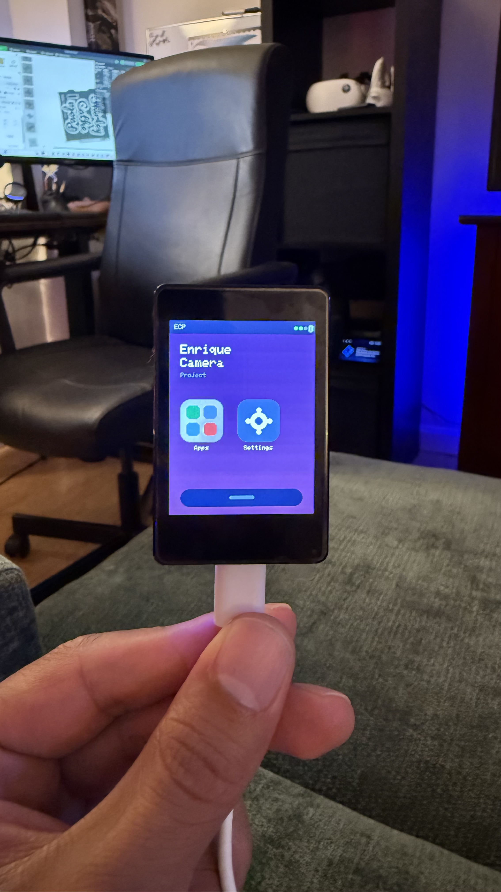
    </td>
    <td>
      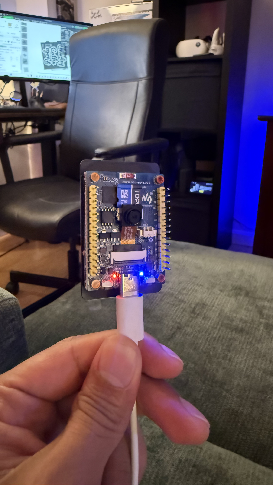
    </td>
  </tr>
</table>
---

## What this project is about

Most ESP32 camera demos are one-trick sketches: a webcam *or* a classifier *or* a stills camera. This repo is the opposite. It is a small **camera OS** for a 2″ touch panel:

- A **home screen** with wallpaper, status bar, Apps folder, and Settings
- An **Apps folder** with icons, the same way a phone groups tools
- **BOOT (GPIO 0)** always returns Home and cleanly stops whatever the current app is doing
- Apps share the camera, display, touch controller, Wi-Fi, SD card, and onboard flash instead of fighting over them

It is still an experiment. The hardware is small, the model is modest, and video is Motion-JPEG rather than H.264. The fun is how far a $20-class board can feel like a real product with a menu.

---

## Hardware

| Piece | What this project uses |
| --- | --- |
| Board | Waveshare **ESP32-S3-Touch-LCD-2** |
| MCU | ESP32-S3R8, dual core, **8 MB PSRAM**, **16 MB flash** |
| Display | 2″ IPS **240×320**, ST7789T3 over SPI |
| Touch | **CST816D** capacitive, I²C |
| Camera | 24-pin **OV2640 / OV5640** DVP |
| Storage | microSD (TF) slot, plus an onboard **FFat** partition |
| USB | Espressif USB-Serial/JTAG |

The running firmware lives in [`EnriqueCamera/`](EnriqueCamera/). That is the product sketch. The other folders are earlier standalone tests that were later folded into the launcher.

---

## Features at a glance

- **Launcher** — title *Enrique / Camera / Project*, Apps folder, Settings, six wallpapers
- **Home button** — short press on BOOT always goes Home
- **Webcam** — SoftAP or home Wi-Fi, browser MJPEG stream, mDNS
- **Scan** — on-device TinyML ImageNet labels on the live view
- **Shoot** — photos, Motion-JPEG video, hyperlapse with a chosen interval
- **Gallery** — browse `/DCIM`, preview stills, play videos, play hyperlapse folders as video
- **Hello World** — tiny GFX smoke test
- **Sky** — live airline arrivals and departures for a pinned airport, with In / Out / Both
- **Flight** — follow one callsign and time it to your pin and the airport
- **Settings** — reconnect saved home Wi-Fi, screen brightness, Sky In/Out filter, wallpaper picker
- **Storage** — SD card first (`/DCIM`), onboard flash if no card is present

---

## The interface

The UI is built for a phone-sized 240×320 panel: big icons, short labels, and almost no typing on the device itself.

### Home screen

<p align="center">
  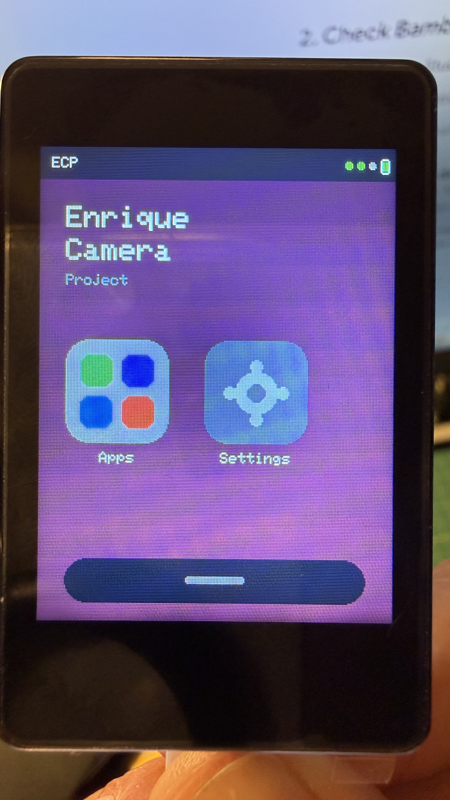
</p>

After boot you land on the home screen:

- Status bar with **ECP** and a fake battery cluster
- Wordmark **Enrique / Camera / Project**
- **Apps** folder (grid of the current app colors)
- **Settings** gear
- Home-indicator pill at the bottom
- Wallpaper is one of six gradients, remembered in NVS

Tap **Apps** to open the folder. Tap **Settings** to configure the device. Press **BOOT** from anywhere to come back here.

### Apps folder

<p align="center">
  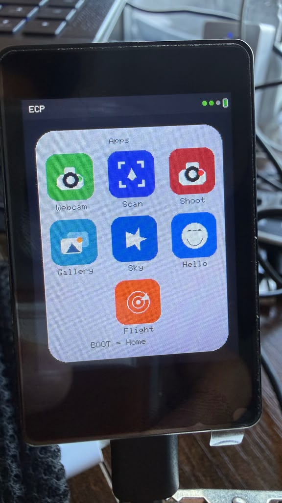
</p>

The folder is a 2″ springboard in three rows:

| Icon | App | What it does |
| --- | --- | --- |
| Cam | **Webcam** | Wireless MJPEG camera for a browser |
| AI | **Scan** | TinyML object labels on the live camera |
| Rec | **Shoot** | Photo, video, and hyperlapse to memory |
| Pic | **Gallery** | Preview photos and play clips / hyperlapses |
| Sky | **Sky** | Airline traffic in and out of your airport pin |
| Hi | **Hello** | Hello World drawing test |
| Radar | **Flight** | One callsign: time over you and to the airport |

Tap outside the card (or BOOT) to return Home. Only one app runs at a time; leaving an app de-inits the camera so the next one can grab it in the right pixel format. Webcam, Sky, and Flight all want port 80 — open one at a time.

### Settings

<p align="center">
  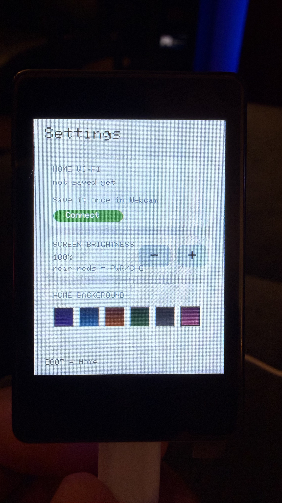
</p>

Settings sits next to Apps on the home screen, not buried in the folder.

- **Home Wi-Fi** — connect / disconnect using the SSID + password saved from the Webcam page (NVS namespace `webcam`). The LCD shows the SSID and, when joined, the STA IP. Sky and Flight reuse that same saved network.
- **Screen brightness** — PWM on the LCD backlight (GPIO 1), 20–100%, remembered in NVS. The two red lights on the back are **power** and **charge** indicators tied to the ETA6098 charger. They are not on a GPIO, so firmware cannot turn them off.
- **Sky arriving / departing** — Both, Arrive, or Leave. Same filter as the In / Out / Both chips inside the Sky app (NVS namespace `flight`).
- **Wallpaper** — six gradient themes (purple, ocean, sunset, forest, graphite, pink). Choice is stored in NVS namespace `ecp`.

BOOT returns Home without losing the saved wallpaper or Wi-Fi credentials.

---

## Apps

### App 1 — Webcam

<p align="center">
  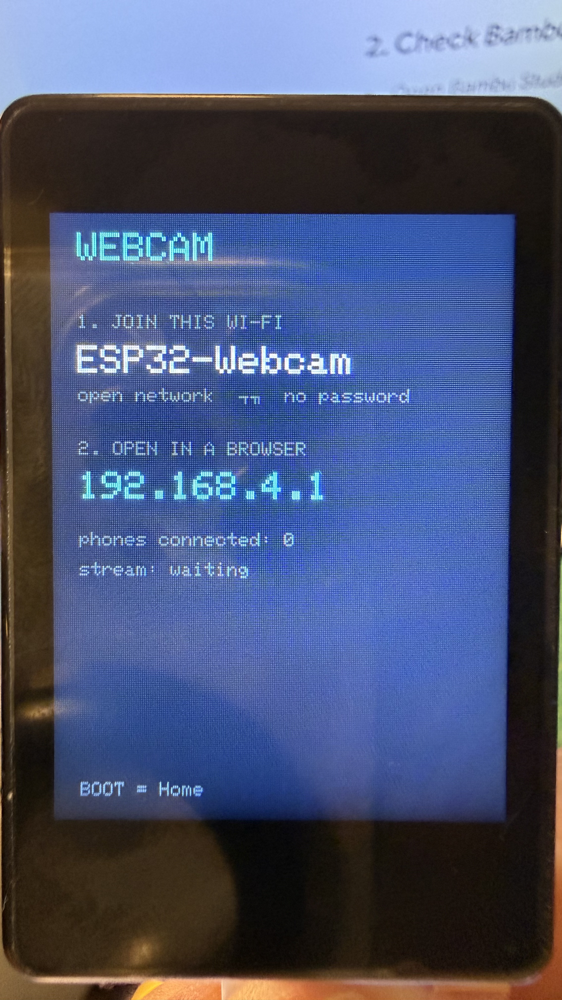
</p>


A wireless camera you open from a phone or laptop.

- Starts an open SoftAP named **`ESP32-Webcam`**
- Web UI at **`http://192.168.4.1`**
- Live stream on the **same origin**: `http://192.168.4.1/stream` (port 80, not 81)
- mDNS name **`esp32-webcam.local`** when the radio is up
- Optional **join home Wi-Fi** from the web page (2.4 GHz only). Join is queued and performed from `loop()` so the HTTP handler does not wedge the radio
- Saved network is reused later from **Settings**
- LCD shows AP vs STA mode, IP address, and viewer count
- Leaving the app (BOOT) tears down the camera and the HTTP servers

This is the “point it at the room and watch it from the couch” app.

### App 2 — Scan (AI)

<p align="center">
  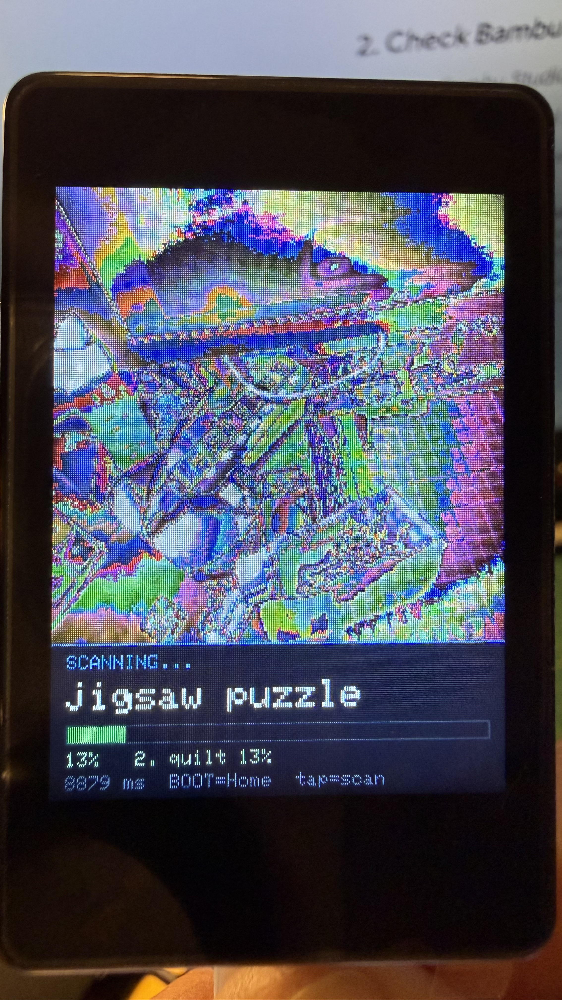
</p>


On-device object recognition with TensorFlow Lite Micro (ESP_TF), not a cloud API.

- Live RGB565 preview on the LCD
- ImageNet-style labels from a bundled MobileNet-class model (`model_data.cpp`, ~597 KB in flash)
- Inference on a separate task (~7–8 s per pass on this board — honest, not magic)
- Top-1 name + confidence bar, plus a runner-up
- Tap the screen to force a scan; HUD shows timing
- Camera is RGB565 (not JPEG) for the model input; the launcher switches modes when you enter/leave

Quality is “party trick,” not production vision. It is still striking that the same gadget that streams video can also guess *coffee mug* without a server.

### App 3 — Shoot

<p align="center">
  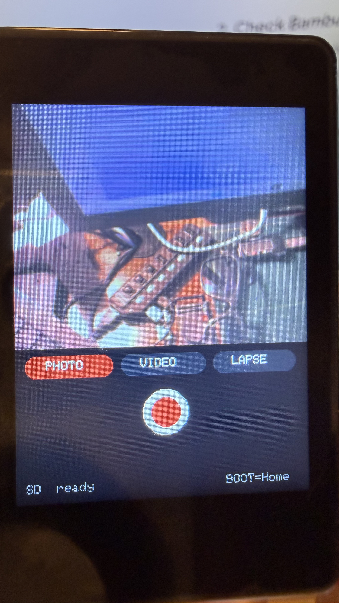
</p>

The actual camera: live preview plus three capture modes.

**PHOTO** — tap the shutter for a VGA JPEG still.

**VIDEO** — tap to start / stop a Motion-JPEG `.avi`. HUD shows a red REC timer. BOOT (or shutter again) patches the AVI header and closes the file so the clip is playable.

**LAPSE (hyperlapse)** — stills on a timer, saved as a folder of JPEGs. When you select hyperlapse, **− / +** pick the gap between shots:

`1 · 2 · 3 · 5 · 10 · 15 · 30 · 60` seconds (default **5**).

Tap shutter to start, tap again to stop. The Gallery app plays that folder back as video.

Files land on the **microSD** card when one is inserted:

| Kind | Path |
| --- | --- |
| Photo | `/DCIM/IMG_0001.jpg` |
| Video | `/DCIM/VID_0001.avi` |
| Hyperlapse | `/DCIM/HYP_0001/00001.jpg`, `00002.jpg`, … |

No card? The HUD shows **FLASH** and files go to the onboard FFat partition (~10 MB class). Keep clips short in that mode. The HUD also shows **SD** vs **FLASH** so you always know where the last file went.

Preview is JPEG → `jpg2rgb565` (2× scale) → a 240-wide RGB565 blit. That path avoids a known shear bug with `draw16bitBeRGBBitmap` on this 240-pixel panel / GFX 1.4.9 combo.

### App 4 — Gallery

<p align="center">
  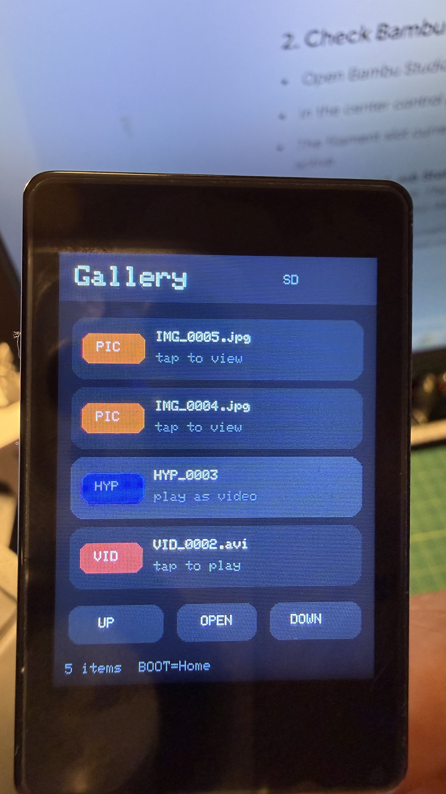
</p>
<p align="center">
  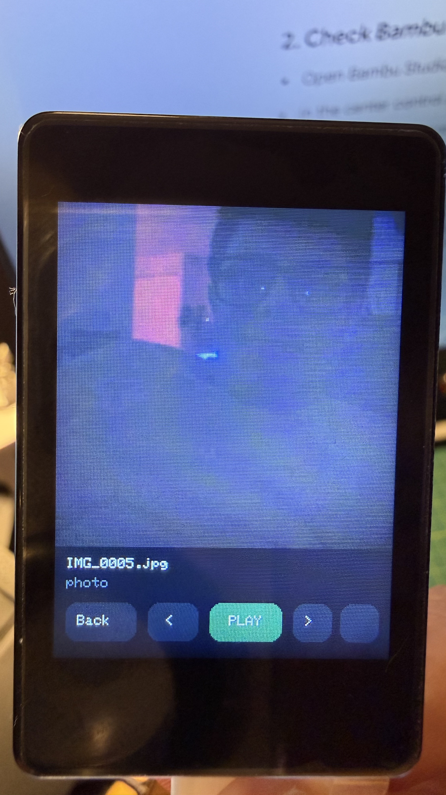
</p>

A viewer for everything Shoot wrote.

- Scans `/DCIM` for `IMG_*.jpg`, `VID_*.avi`, and `HYP_*` folders
- Newest first
- **PIC** — open a still
- **VID** — play the AVI as a frame-by-frame MJPEG clip (~8 fps), looping
- **HYP** — treat the hyperlapse stills **as video**, not a photo stack
- **UP / DOWN / OPEN** on the list; tap a row to open
- Viewer: **Back**, **PLAY / STOP**, **&lt; &gt;** previous/next
- BOOT stops playback and returns Home

This is how the hyperlapse interval you picked in Shoot becomes a little movie on the device itself.

### App 5 — Hello World

<p align="center">
  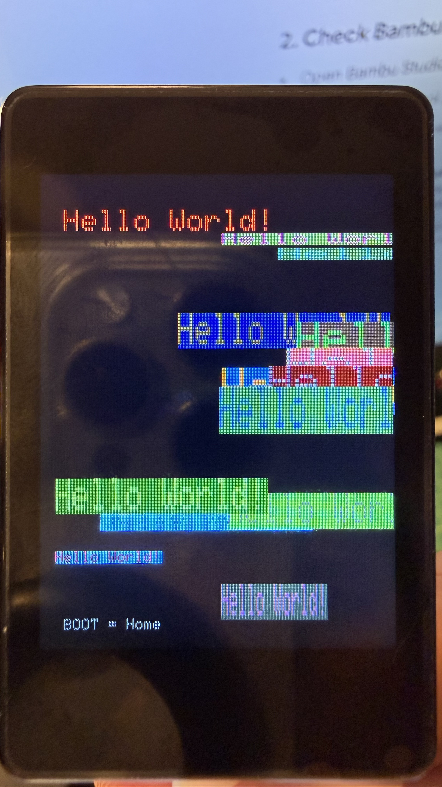
</p>


The first thing that ever drew on this LCD, kept as an app. It stamps random-color **Hello World!** text so you can confirm the panel, backlight, and home button still work after a scary flash.

### App 6 — Sky

<p align="center">
  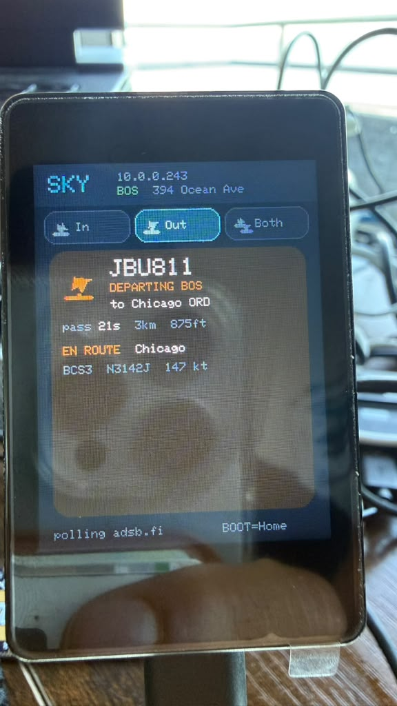
</p>

Overhead airline tracker for the airport you pin (default **BOS Logan**) and a home pin you set from the phone page.

- Live positions from **adsb.fi**, with **adsb.lol** as backup
- Routes from **adsbdb.com** so the screen can say arriving *from* a city or departing *to* a city
- **In / Out / Both** chips on the LCD (and the same filter in Settings). In and Out are different lists, not the same plane relabeled
- **Both** stacks the best arrival and the best departure
- Pass-you timer uses your home pin; landing timer uses distance to the airport
- Phone config SoftAP **`ESP32-Flights`**, page at **`http://192.168.4.1`** or **`http://esp32-flights.local`** — drop a Leaflet pin or paste a Google Maps link for home and airport
- Only scheduled-looking airline callsigns (not N-numbers or typical bizjets). Overflights that are not in/out of your airport are ignored

Needs the home Wi-Fi saved from Webcam (2.4 GHz). BOOT returns Home and stops the flight HTTP server.

### App 7 — Flight

<p align="center">
  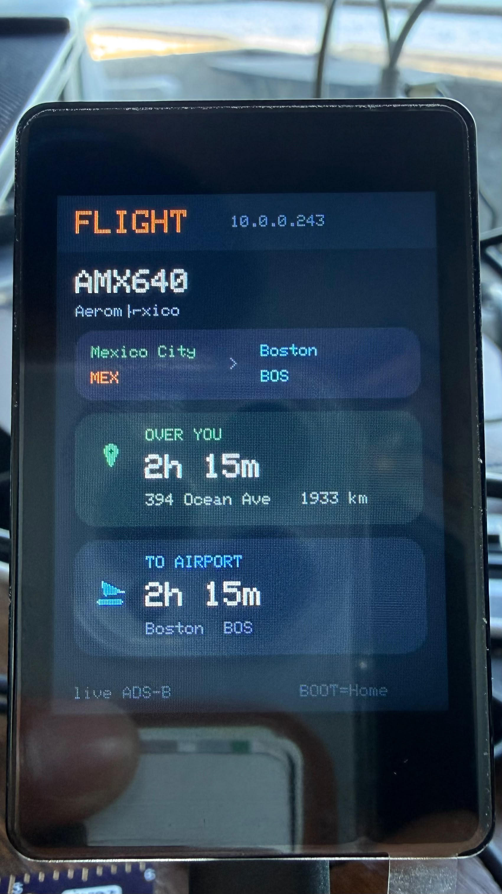
</p>

Track **one** callsign end to end — for example a transcon you care about — instead of whoever is nearest.

- Type the flight on the phone page (SoftAP **`ESP32-Track`**, **`http://192.168.4.1`** or **`http://esp32-track.local`**)
- Reuses the Sky home pin and airport pin
- LCD shows airline, origin → destination, **OVER YOU**, and **TO AIRPORT**
- Live position: adsb.fi / adsb.lol callsign, then OpenSky by hex or a small map box along the route
- If ADS-B has the route but no position yet (ocean / coverage gap), the clocks show **no ADS-B** instead of a fake ETA
- Callsign is stored in NVS namespace `track`

Same port-80 rule as Webcam and Sky: only one of those apps at a time.

---

## Storage and memory

- **microSD** on GPIO **41** (CS), sharing SPI with the LCD (SCK 39, MOSI 38, MISO 40)
- LCD CS is held idle while the card is selected
- If `SD.begin` fails, firmware mounts **FFat** on the custom partition map
- Capture index (`IMG_0001`, `VID_0002`, …) is a monotonic counter in NVS namespace `shoot`

Custom flash layout ([`EnriqueCamera/partitions.csv`](EnriqueCamera/partitions.csv)):

| Name | Role | Size |
| --- | --- | --- |
| `nvs` | Wi-Fi, wallpaper, file index | 20 KB |
| `app0` | Unified firmware | **6 MB** |
| `ffat` | Onboard file fallback | ~10 MB |

Do **not** flash this sketch with `app3M_fat9M_16MB` — the combined firmware (especially the TFLite model) needs the 6 MB factory app slot.

---

## Home button

**BOOT / GPIO 0** is the home button, not LCD reset.

- Short press from any app → leave that app (stop recording, stop stream, close files) → home screen
- The same pin is still the ROM boot-strap pin, so hold it only when you intend to enter download mode

---

## Build and flash

Needs [Arduino CLI](https://arduino.github.io/arduino-cli/) (or the Arduino IDE) with **esp32 core 3.x**, **PSRAM = OPI**, and the GFX Library for Arduino.

```bash
FQBN='esp32:esp32:esp32s3:USBMode=hwcdc,CDCOnBoot=cdc,FlashSize=16M,PartitionScheme=custom,PSRAM=opi,UploadSpeed=921600'

arduino-cli compile --fqbn "$FQBN" EnriqueCamera
arduino-cli upload -p /dev/cu.usbmodem1101 --fqbn "$FQBN" EnriqueCamera
```

On Windows the port looks like `COMx`; on Linux often `/dev/ttyACM0`.

Libraries used by the unified firmware:

- Arduino GFX Library
- `esp_camera` / `img_converters` (ESP32 core)
- SD, FFat, Preferences, WiFi, ESPmDNS, HTTP server
- ESP_TF / TensorFlow Lite Micro (Scan app)
- HTTPClient, WiFiClientSecure, ArduinoJson (Sky + Flight ADS-B)

Serial is 115200. On a good boot you should see `Enrique Camera Project` and `Find CST816!`.

---

## Pin map (this board)

**LCD SPI** — SCLK 39, MOSI 38, MISO 40, DC 42, CS 45, RST *not used*, BL GPIO 1  

**Touch I²C** — SDA 48, SCL 47, INT 46, CST816 address `0x15`  

**Camera DVP** — PWDN 17, RST -1, XCLK 8, SIOD 21, SIOC 16, Y9–Y2: 2, 7, 10, 14, 11, 15, 13, 12, VSYNC 6, HREF 4, PCLK 9  

**SD** — CS **41** (same SPI as the LCD)  

**BOOT / Home** — GPIO 0  

The camera sensor is **vflip = 1** on this module. GPIO 13/14 are camera data lines on this board — do not enable `CAMERA_MODEL_ESP_EYE` pull-ups on them.

---

## Repository layout

```
EnriqueCamera/          ← the mini-phone firmware (flash this)
  EnriqueCamera.ino     launcher, home, folder, BOOT dispatch
  app_webcam.cpp        wireless webcam
  app_recognizer.cpp    TinyML scan
  app_shoot.cpp         photo / video / hyperlapse
  app_gallery.cpp       preview + playback
  app_hello.cpp         Hello World
  app_settings.cpp      Wi-Fi, Sky filter, wallpapers
  app_flights.cpp       Sky overhead tracker
  app_track.cpp         Flight one-callsign tracker
  flight_server.cpp     Sky phone map / pins
  track_server.cpp      Flight callsign page
  camera_hw.cpp         JPEG vs RGB565 camera bring-up
  storage.cpp           SD then FFat
  stream_server.cpp     HTTP UI + /stream
  model_data.cpp        bundled TFLite weights
  partitions.csv        6 MB app + FFat
WebCam/                 earlier standalone webcam sketch
ObjectRecognizer/       earlier standalone TinyML sketch
02_gfx_helloworld/      official LCD bring-up sketch
docs/images/            photos + placeholders for this README
```

---

## Honest limits

- Scan is ImageNet-class and slow. It will mislabel things. That is part of the experiment.
- Video is MJPEG AVI, not MP4/H.264. Players that accept Motion-JPEG AVI (VLC, QuickTime in many cases, the on-device Gallery) are the target.
- LCD and SD share one SPI bus. Heavy recording plus a busy preview can drop frames.
- Onboard flash is a safety net, not a film roll. Use a microSD card for real shoots.
- SoftAP is open (no password) so a phone can join without typing on a 2″ screen. Treat it as a bench network.
- Wi-Fi is **2.4 GHz only**. A 5 GHz-only home SSID will not join.
- Sky and Flight use public ADS-B aggregators (no FlightRadar24 key). Coverage has gaps, especially over water, and a “departed” status on a phone app does not always mean a live position.
- Sky In / Out is only as good as the route database plus climb/descent. Random overflights are hidden on purpose.

---

Built as a weekend-scale experiment on a Waveshare ESP32-S3 touch LCD — a camera that boots into a home screen.
